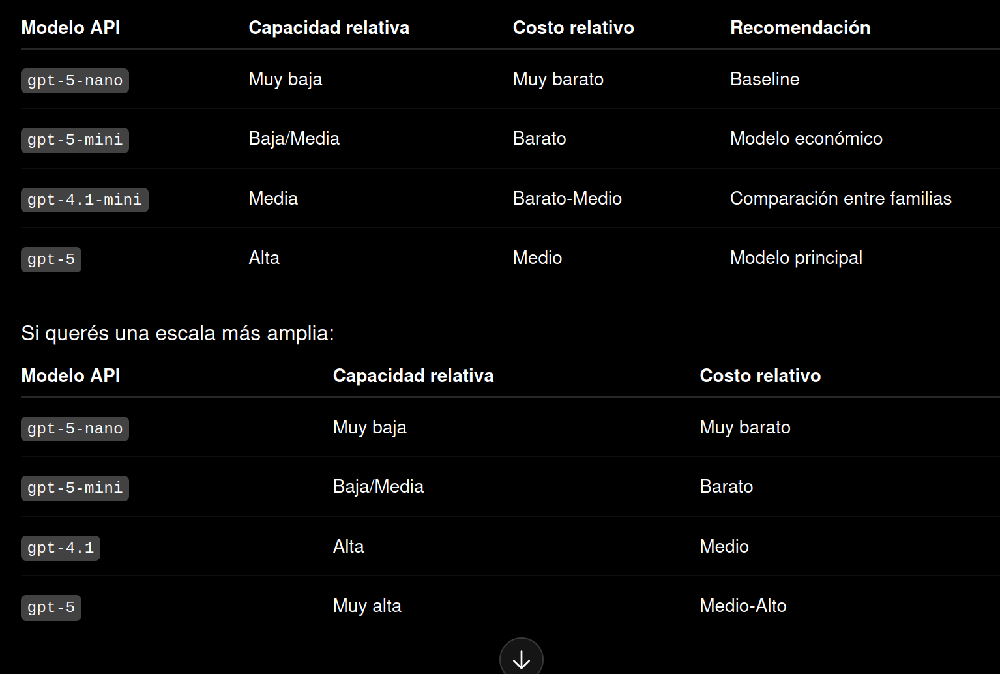

# Evaluación unificada S1 / S2 / S3

Esta carpeta contiene todos los scripts necesarios para construir el dataset de evaluación, correr los tres sistemas RAG y exportar los resultados.

## Estructura

```
evaluation/
  build_eval_dataset.py      # Fase 1: arma el set de 100 preguntas
  run_evaluation_pipeline.py # Fase 2: corre S1/S2/S3
  export_eval_results.py     # Fase 3: exporta XLSX unificado
  run_eval_pipeline.ps1      # Orquestador PowerShell (fases 1-3)
  run_frame_pipeline.ps1     # Pipeline original S1-S4 (datasets propios)
  README.md                  # Este archivo
```

Los scripts Python se ejecutan **desde la raíz del proyecto** (o vía los `.ps1` que hacen el `cd` automáticamente).

---

## Requisitos

```bash
pip install sentence-transformers openpyxl pandas numpy
export OPENAI_API_KEY="sk-..."
```

---

## Uso rápido (modelo default)

```powershell
# Desde la raíz del proyecto:
.\evaluation\run_eval_pipeline.ps1 -BuildDataset
```

Esto:
1. Construye `data/eval/questions_eval.csv` (80 HotpotQA + 20 TruthfulQA) e índice vectorial.
2. Corre S1, S2 y S3 sobre las 100 preguntas.
3. Exporta `outputs/eval/evaluation_default.xlsx`.

---

## Correr con un modelo distinto

Pasá `-Model` con el nombre exacto de la API de OpenAI:

```powershell
# GPT-4o mini
.\evaluation\run_eval_pipeline.ps1 -Model "gpt-4o-mini"

# GPT-4o
.\evaluation\run_eval_pipeline.ps1 -Model "gpt-4o"

# GPT-4 Turbo
.\evaluation\run_eval_pipeline.ps1 -Model "gpt-4-turbo"

# GPT-3.5 Turbo
.\evaluation\run_eval_pipeline.ps1 -Model "gpt-3.5-turbo"
```

El nombre del modelo se transforma en un tag limpio (e.g. `gpt-4o-mini` → `gpt_4o_mini`) que se usa para nombrar todos los archivos de salida, así múltiples rondas no se pisan:

```
outputs/eval/s1_gpt_4o_mini_results.csv
outputs/eval/evaluation_gpt_4o_mini.xlsx
```

---

## Flags disponibles (`run_eval_pipeline.ps1`)

| Flag | Descripción | Default |
|---|---|---|
| `-Mode` | `real` corre con la API, `dry-run` imprime el comando sin llamar a OpenAI | `real` |
| `-Model` | Nombre del modelo OpenAI | `""` (usa el default del proyecto) |
| `-Systems` | Sistemas a correr: `s1`, `s2`, `s3` o combinaciones | `s1,s2,s3` |
| `-Limit` | Limita a las primeras N preguntas (útil para smoke tests) | `0` (todas) |
| `-BuildDataset` | Construye el dataset + índice vectorial antes de correr | `false` |
| `-Resume` | Si ya existe un raw CSV parcial, continúa desde donde quedó | `false` |
| `-Force` | Sobreescribe todos los outputs existentes | `false` |

### Ejemplos

```powershell
# Smoke test: 5 preguntas, solo S1 y S2
.\evaluation\run_eval_pipeline.ps1 -Limit 5 -Systems "s1,s2"

# Ver que comandos se ejecutarían sin gastar API
.\evaluation\run_eval_pipeline.ps1 -Mode dry-run -Model "gpt-4o-mini"

# Retomar una corrida interrumpida
.\evaluation\run_eval_pipeline.ps1 -Model "gpt-4o-mini" -Resume

# Correr solo S3 con force (sobreescribe)
.\evaluation\run_eval_pipeline.ps1 -Systems "s3" -Force
```

---

## Correr por pasos (Python directo)

Si preferís correr cada fase por separado desde la raíz del proyecto:

```bash
# Fase 1: construir dataset (solo la primera vez o con --force)
python evaluation/build_eval_dataset.py

# Fase 2: correr los sistemas
python evaluation/run_evaluation_pipeline.py --model gpt-4o-mini

# Fase 3: exportar XLSX
python evaluation/export_eval_results.py --model gpt-4o-mini
```

Para smoke tests:

```bash
python evaluation/run_evaluation_pipeline.py --limit 5 --systems s1,s2
python evaluation/export_eval_results.py --model default
```

---

## Archivos generados

```
data/eval/
  questions_eval.csv        # 100 preguntas (80 retrieve + 20 direct)
  corpus_eval.csv           # chunks de los 80 documentos retrieve
  qrels_eval.csv            # evidencia gold
  build_summary.json        # estadísticas de construcción

indexes/eval/
  chunks.csv                # corpus indexado
  embeddings.npy            # vectores 384-dim normalizados
  metadata.json             # info del índice

outputs/eval/
  s1_<model>_raw.csv        # respuestas crudas S1
  s1_<model>_results.csv    # evaluadas
  s2_<model>_routing_results.csv  # evaluación del router S2
  s2_<model>_results.csv
  s3_<model>_results.csv
  evaluation_<model>.xlsx   # XLSX final con todas las hojas
```

---

## XLSX: hojas y columnas

El XLSX tiene una hoja por sistema (**S1**, **S2**, **S3**) con columnas unificadas:

| Columna | Descripción |
|---|---|
| `question_id` | ID de la pregunta |
| `question` | Texto de la pregunta |
| `gold_answer` | Respuesta esperada |
| `expected_route` | `retrieve` o `direct` |
| `source_dataset` | `hotpotqa` o `truthfulqa` |
| `model_answer` | Respuesta del sistema |
| `is_correct` | Booleano de corrección |
| `token_f1` | F1 a nivel token |
| `latency_total_s` | Latencia total en segundos |
| `latency_retrieval_s` | Latencia de retrieval |
| `n_docs_retrieved` | Chunks recuperados |
| `retrieval_recall` | Recall sobre qrels |
| `predicted_route` | Solo S2: ruta elegida por el router |
| `route_match_expected` | Solo S2: si el router acertó |
| `n_generation_steps` | Solo S3: pasos de generación |
| `tokens_total` | Tokens consumidos |
| `error` | Mensaje de error si falló |

Hoja **`resumen`**: métricas agregadas por sistema y por tipo de pregunta (ALL / retrieve / direct). S2 incluye `routing_accuracy` global y por grupo.

Hoja **`metadata`**: modelo, fecha, commit, paths de inputs.

---

## Modelos usados en la evaluación



Los modelos de OpenAI que se comparan en este pipeline son:

| Modelo | Familia | Cuándo usarlo |
|---|---|---|
| `gpt-5-nano` | GPT-5 | Baseline más barato y rápido. Establece el piso de comparación. Ideal para smoke tests. |
| `gpt-5-mini` | GPT-5 | Balance calidad/costo. Recomendado para la corrida principal (~$1-2 USD para 100 preguntas × 3 sistemas). |
| `gpt-4.1-mini` | GPT-4.1 | Alternativa de la familia 4.1, útil para comparar familias distintas de modelos. |
| `gpt-5` | GPT-5 | Techo de calidad. Más caro; recomendado para la ronda final de comparación. |

**Cómo afecta el modelo a cada sistema:**

- **S1 (RAG clásico)**: el modelo genera la respuesta final dado el contexto recuperado. Un modelo más capaz mejora la síntesis.
- **S2 (Adaptive-RAG)**: el modelo se usa dos veces — primero el **router** (decide si ir a retrieval o responder directo) y luego la **generación**. Modelos mejores toman mejores decisiones de routing en las preguntas "direct".
- **S3 (FLARE-like)**: el modelo genera iterativamente y decide cuándo necesita más contexto. La calidad del modelo impacta fuertemente en cuántos pasos de retrieval se hacen.

---

## Pipeline original S1-S4

`run_frame_pipeline.ps1` corre el pipeline original (cada sistema con su propio dataset):

```powershell
# Demo con outputs pre-existentes
.\evaluation\run_frame_pipeline.ps1 -Mode demo

# Dry-run: imprime comandos sin llamar a la API
.\evaluation\run_frame_pipeline.ps1 -Mode dry-run -Limit 5

# Corrida real con 10 preguntas por sistema
.\evaluation\run_frame_pipeline.ps1 -Mode real -Limit 10

